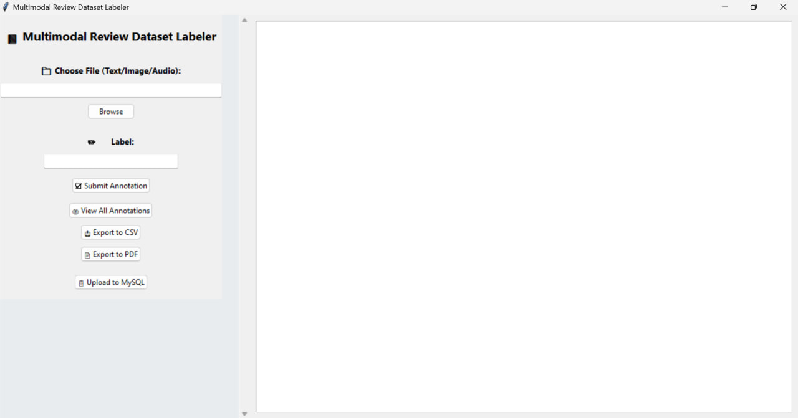

# 🎯 Multimodal Review Dataset Labeler

A Tkinter-based GUI tool to **label, organize, and export multimodal data** (Text, Image, Audio) with real-time annotations and MySQL integration. Built for data preprocessing pipelines in machine learning workflows.

---

## 🚀 Features

- 📂 **Import** text, image, or audio files
- 🏷️ **Manually label** content with custom tags
- 🧾 **View** all annotations in-app
- 📤 **Export** annotations as:
  - CSV (`annotations.csv`)
  - PDF (`annotations.pdf`)
  - MySQL Database (`annotation_db.sql`)
- 💾 **Structured MySQL uploads** with `source_type` auto-tagging
- 🎨 **Responsive full-screen UI** with scrollable layout
- 🧠 **Built using**: Python, Tkinter, Pandas, FPDF, PyMySQL, PIL (Pillow)

---

## 🛠️ Tech Stack

| Component        | Tech                            |
|------------------|----------------------------------|
| Language         | Python 3.10+                    |
| GUI Framework    | Tkinter                         |
| Data Export      | Pandas, FPDF                    |
| Image Handling   | PIL (Pillow)                    |
| Database         | MySQL + PyMySQL Connector       |
| PDF Generator    | FPDF                            |

---

## 📸 UI Preview



---

## 📦 Installation

1. **Clone the repo**
   ```bash
   git clone https://github.com/jetti-charanteja/Multimodal-Review-Dataset-Labeler.git
   cd multimodal-review-labeler
2. **Install dependencies**
   ```bash
   pip install -r requirements.txt
3. **Start MySQL and create DB (one-time setup)**
   ```sql
CREATE DATABASE IF NOT EXISTS annotation_db;
USE annotation_db;

CREATE TABLE IF NOT EXISTS annotations (
    id INT AUTO_INCREMENT PRIMARY KEY,
    file VARCHAR(255) NOT NULL,
    label VARCHAR(255) NOT NULL,
    source_type ENUM('Text', 'Image', 'Audio', 'Unknown') DEFAULT 'Unknown',
    timestamp DATETIME DEFAULT CURRENT_TIMESTAMP
);

4. **Update your db_config**
   ```bash
   # DB Config
DB_CONFIG = {
    "host": "localhost",
    "user": "root",
    "password": "root",
    "database": "annotation_db",
    "port": 3306,
    "charset": "utf8mb4",
    "autocommit": True
} 

5. **Run the app**
   ```bash
   python main.py

## 📁 Folder Structure

```css
📦 multimodal-review-labeler/
 ┣ 📜 main.py
 ┣ 📜 requirements.txt
 ┣ 📁 IMAGES/
 ┃ ┗ 📸 main_ui.jpg
   ┗ 📸 annotation_entry.jpg
   ┗ 📸 submit_annotation.jpg
   ┗ 📸 view_annotations.jpg
   ┗ 📸 csv_annotation.jpg
   ┗ 📸 pdf_annotation.jpg
   ┗ 📸 mysql_upload_annotation.jpg
 ┣ 📄 annotations.csv
 ┗ 📄 annotations.pdf

## 🙋‍♀️ **Author**
```user
    👤 Jetti Charan Teja Naga Sai
    💼 Developed as part of real-world multimodal AI tooling
    📫 Feel free to connect via LinkedIn or GitHub

## ⭐️ Show Some Love

If this tool helped you in any way, do ⭐️ star the repo and consider contributing!

``` text
✨ Your labels power better models!

## 📄 License

This project is licensed under the MIT License. See the LICENSE file for details.

``` yaml

---

✅ Let me know if you want:
- README in **Telugu** (for regional GitHub audience)
- Aesthetic badge style (using Shields.io)
- GitHub Actions for auto testing/export

Want me to generate your `requirements.txt` too?

